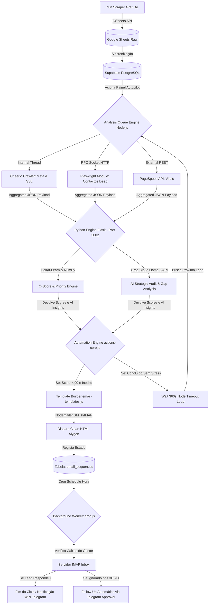

# Alygen CRM: Detailed Architecture & Complete Data Flow 🔄

Este documento destrinça ao nível do bit o ciclo de vida completo de uma operação no Alygen CRM, desde a captura inicial de intenção até ao follow-up dinâmico. A arquitetura obedece a um forte padrão de **Event-Driven Microservices** (abrangendo Node.js, Python FastAPI/Flask e Vite React).

---

## 🏗️ 1. Diagrama de Arquitetura de Alto Nível
Abaixo a representação visual dos componentes, demonstrando com exatidão a interação sincrónica entre Módulos e a parte assíncrona da Automação.

## 🌍 2. Data Mining & Ingestão (Data Lake Raw)
Todo o funil inicia-se muito antes do CRM abrir, numa infraestrutura passiva.

- **Ator principal:** n8n Workflow alojado externamente (geralmente gerador diário).
- **Mecânica:** O robot n8n faz scraping de diretórios B2B / Google Maps utilizando *selectors* lógicos para encontrar PMEs recém-criadas ou mal pontuadas no mercado, recolhendo `domain`, `name`, `type`. De seguida, injeta-as passivamente na folha conectada *Google Sheets (Master)*.
- **Integração CRM:** Pelo lado do CRM (na secção `/sources` e painel de Admin), a script `backend/services/supabase-service.js` transpõe os dados do formato de Excel para um banco de dados Relacional Postgres. A engine valida TLDs inválidos e bloqueia duplicação de registos (Unique Constraint Email/Website).

## 🧠 3. O Motor de Queueing & Paralelismo Sensível
Não varremos sites dos clientes usando força bruta para os servidores deles não nos marcarem como *DDoS Attack*. 

- **Componente Principal:** `backend/analysis-queue.js`
- **Throttling e Limites:** Gere um *Event Loop virtualizado* temporizando a Fila e debitando apenas 1 Target por cada 20000ms (20 segundos limpos).
- **Multithreading Lógico (`Promise.all`):**
  1. **Google PageSpeed Insights:** O controlador principal submete os requests à framework LCP/FCP e extrai o JSON da verdadeira "Saúde" do site nos telemóveis.
  2. **Fast Crawler Engine (`cheerio`):** Interseta as `meta tags` instantâneas, conferindo se os WebMasters deixaram o site destrancado sem SSL e aferindo a matriz digital de tags de Marketing (Pixel do Google, Tag Manager, Facebook).
  3. **Playwright Deep Dive (Python):** Se o E-mail estava omisso no Sheets, este robô "desperta" em container Linux isolado, navega pelas páginas /sobre, /contacto (inclusive lendo de trás para a frente com lxml/beautifulsoup para emails *obfuscados*), superando facilmente os Scraping Bots tradicionais.

## 🎯 4. O Sistema Nervoso Analítico (ML & Groq Llama)
Aqui os dados avulsos fundem-se formando conhecimento de valor comercial direto.

- **Componentes Focais:** Servidor Python (`score_engine.py`) e Integração Groq LPU (`seo-analyzer.js`).
- **Lógica Vectorial NumPy:** No Python, as 15 matrizes de variáveis caem num *Calculus de Dot Product*. Aplica penalizações severas por lentidão (`< 25 mobile`) ou falta de SSL.
- **Benchmarking Regional Competitivo:** Outra parte do código pesquisa concorrentes na mesma *City* + *Category* dentro da própria base de dados do CRM e define se este Lead específico se encontra no escalão de "Urgent Gap" no seu mercado perante os próprios rivais.
- **Groq NLP Analytics:** Em tempo relâmpago, todo o conteúdo da Home Page submetido é interpretado por LLaMA-3 (IA Generativa). O resultado aponta *Semantic Content Gaps* e devolve uma Auditoria textual impecável e real ao JSON.

## ⚙️ 5. State Machine: O Circuito Autopilot (React Flow)
Ao devolver o objeto completo, o Event Listener "acorda" e dispara a Máquina de Guerra Automática.

- **Componentes Focais:** JSON dos diagramas UI via Node.js (`actions-core.js`).
- **Avaliações dos Nodos em Cascata (O percurso puro de 1x Lead):**
  1. *Filtro 1* `Condicional`: O Lead tem e-mail e é uma Oportunidade Alta (Sub 90 pontos)?
  2. *Filtro 2* `Fator Novidade`: Esta empresa nunca caiu numa campanha nossa antes (`alreadyEmailed == false`)?
  3. *Ação Fulcral* `Send Email`: O Módulo passa as Variáveis Interpoladas (onde cai a "Auditoria da LLaMa-3", o "Benchmark do Python") para as máscaras estéticas de Layout localizadas em `email-templates.js`. Envia a proposta/auditoria massiva de forma indetetável e humana via autenticação Nodemailer.
  4. *Google API Track*: Marca-o no G.Sheets secundário ("Enviado") para Tracking do Gestor Operacional.
  5. *Autopilot Loop Action*: Ao concluir a 1ª bateria, o Nó assenta com um `wait_timeout = 360s` (Média 6 minutos). Ao término, acorda invadindo novamente a queue e **engatando a próxima vítima crua** na Fila de Analise. É um Loop Perpétuo Sem-Mãos.

## 🔁 6. Defesa Corporal & Anti-Spam (Follow-ups) 🛡️
Um sistema automatizado sem barreiras leva a Spam Blacklists rapidamente. Este é o cordão defensivo:

- **Componente Guardião:** O Script Operário *Worker* (`cron.js`) + Biblioteca IMAP de leitor de Caixas de Correio embutidos no CRM.
- **Gestão Diária de Sequências Assíncrona:**
  - De hora a hora, o Cron analisa as linhas da tabela `email_sequences` em estado Pendente (Espera).
  - O robô faz login diretamente no email imap do Comercial (`process.env.IMAP_USER`) e averigua a Inbox (Received & Read Receipts).
  - Padrões de Triagem:
    * **Se respondeu ativamente ao nosso 1º E-mail:** O CRM altera a flag na DB para "Sucesso". Trava todo e qualquer e-mail robótico com base nesse e-mail ID. Notificando o Gestor no `Telegram Bot`: *Ganhaste Interação!*
    * **Se passarem os Exatos 3 Dias sem ler ou ignorando:** A API do Telegram contacta o Gestor com um pop-up de Aprovação (*Telegram Inline Keyboard*). Este toque requer a aprovação do dono (anti spam rigoroso).
    * **Se Aprovado no D3:** É libertado internamente o template Follow-up de choque. Repetindo a lógica temporal até ao derradeiro e-mail de Dia 7.
