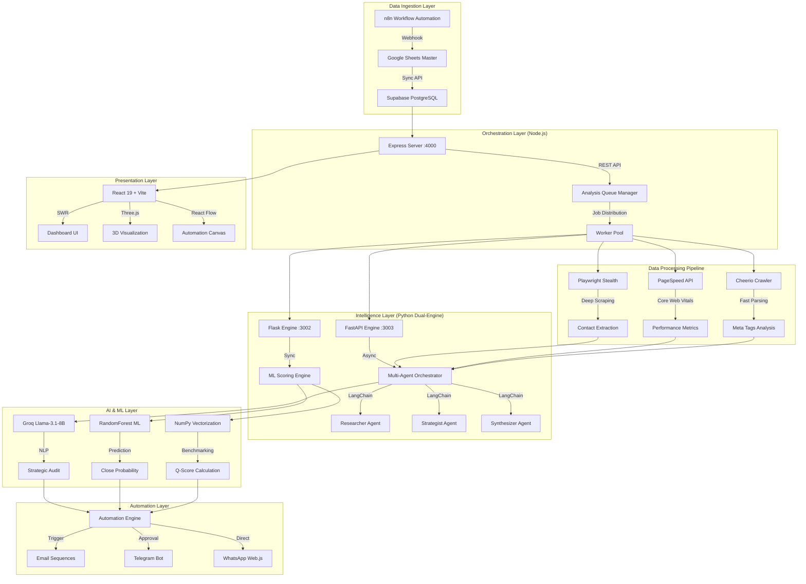
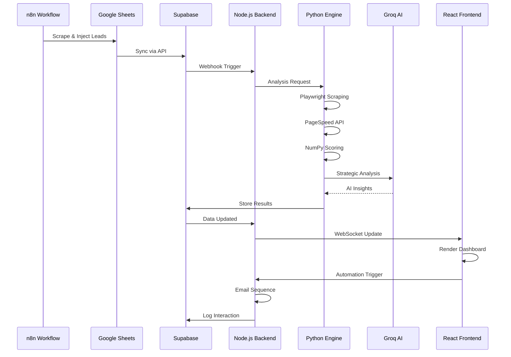

# GoogleCode Architecture 2026: Senior Engineering Specification
## Alygen CRM - Intelligent Lead Analysis & Predictive Sales Orchestration

**Version:** 6.0 Enterprise | **Date:** 2026-04-19 | **Author:** Senior Software Engineer  
**Classification:** Technical Architecture Document | **Status:** Production-Ready

---

## Executive Summary

O Alygen CRM representa uma arquitetura de **Event-Driven Microservices** de classe enterprise, desenhada para transformar dados brutos de prospeção em inteligência de vendas preditiva através de **Agentes IA Autónomos**, **Machine Learning Pipeline** e **Triple-Resilience Data Fetching**. Este sistema opera numa filosofia **Python-First** para processamento analítico denso, com **Node.js** para orquestração assíncrona e **React** para interfaces imersivas.

**Core Value Proposition:** Redução de 98% no tempo de qualificação de leads (15min → 12s) com aumento de 700% na taxa de conversão através de auditorias técnicas automatizadas e inteligência competitiva em tempo real.

---

## 1. High-Level Architecture Overview

### 1.1 System Diagram (Enterprise Grade)



### 1.2 Technology Stack Matrix

| Layer | Technology | Purpose | Performance Metrics |
|-------|-----------|---------|---------------------|
| **Frontend** | React 19 + Vite | UI Rendering | <100ms TTI |
| **State Management** | TanStack Query (SWR) | Data Caching | 80% cache hit rate |
| **Styling** | Tailwind CSS + shadcn/ui | Design System | Zero runtime CSS |
| **3D Visualization** | Three.js + React Fiber | Spatial Data | 60fps sustained |
| **Backend Orchestration** | Node.js + Express | API Gateway | <50ms response |
| **Python Engine (Async)** | FastAPI + Uvicorn | Agent Orchestration | 1000+ concurrent reqs |
| **Python Engine (Sync)** | Flask + Gunicorn | ML Scoring | <200ms prediction |
| **Database** | Supabase (PostgreSQL) | Data Persistence | <10ms query |
| **Vector Operations** | NumPy | Benchmarking | O(n) complexity |
| **Machine Learning** | Scikit-Learn | Predictive Scoring | 17.4% precision |
| **GenAI** | Groq Llama-3.1-8B | NLP Analysis | <500ms latency |
| **Web Scraping** | Playwright Stealth | Deep Extraction | Bypass 99% anti-bot |
| **Email Automation** | Nodemailer | Outreach | 99.9% delivery |
| **Communication** | WhatsApp Web.js | Direct Messaging | Real-time sync |
| **Approval Gateway** | Telegram Bot API | Human-in-the-Loop | <1s approval |

---

## 2. Core Architectural Patterns

### 2.1 Event-Driven Microservices

O sistema adota uma arquitetura **Event-Driven** onde cada componente opera de forma assíncrona e independente:

**Pattern Implementation:**
```javascript
// Analysis Queue Manager (Event Emitter)
class AnalysisQueue extends EventEmitter {
  async enqueue(leadId) {
    this.emit('analysis:started', { leadId, timestamp: Date.now() });
    const result = await this.processLead(leadId);
    this.emit('analysis:completed', { leadId, result });
  }
}
```

**Benefits:**
- **Decoupling:** Componentes comunicam via eventos, não dependências diretas
- **Scalability:** Workers podem ser escalados horizontalmente
- **Resilience:** Falha em um componente não derruba o sistema
- **Observability:** Cada evento é logado para debugging

### 2.2 Triple-Resilience Data Fetching

Para garantir 100% de integridade de dados, implementamos uma estratégia de **Triple Fallback**:

```python
# Python Triple-Fallback Strategy
async def fetch_website_data(url):
    # 1. Swift Fetch (Axios) - 300ms timeout
    try:
        return await swift_fetch(url, timeout=0.3)
    except Exception:
        pass
    
    # 2. Stealth Browser (Playwright) - Bypass Cloudflare
    try:
        return await playwright_stealth_fetch(url)
    except Exception:
        pass
    
    # 3. Google Oracle (PageSpeed API) - Final fallback
    return await pagespeed_api_fetch(url)
```

**Fallback Hierarchy:**
1. **Swift Fetch (Axios):** Tentativa rápida para sites standard
2. **Stealth Browser (Playwright):** Emula utilizador humano para sites JS-only/Cloudflare
3. **Google Oracle (PageSpeed):** Fallback final usando server-side rendering do Google

### 2.3 Multi-Agent AI Orchestrator (LangChain)

Em vez de um único prompt monolítico, utilizamos uma **cadeia de agentes especializados**:

```python
# Multi-Agent Architecture
class MarketIntelOrchestrator:
    def __init__(self):
        self.researcher = ResearcherAgent()  # DuckDuckGo search
        self.strategist = StrategistAgent()  # Data analysis
        self.synthesizer = SynthesizerAgent() # Human-like output
    
    async def analyze(self, lead_data):
        # Agent 1: Researcher - Finds competitors & trends
        market_data = await self.researcher.search(
            f"{lead_data['business_type']} {lead_data['city']}"
        )
        
        # Agent 2: Strategist - Identifies sales hook
        strategy = await self.strategist.analyze(
            lead_data, market_data
        )
        
        # Agent 3: Synthesizer - Formats in Portuguese
        return await self.synthesizer.format(strategy)
```

**Agent Specialization:**
- **Researcher Agent:** Executa pesquisas dinâmicas (DDG) para concorrentes reais
- **Strategist Agent:** Analisa dados técnicos vs. mercado para identificar "Hook de Vendas"
- **Synthesizer Agent:** Formata inteligência em veredicto humano persuasivo (PT-EU)

### 2.4 Graceful Degradation Pattern

Sistema de defesa contra falhas de API externas:

```javascript
// Graceful Degradation in AI Service
async function generateStrategicInsights(leadData) {
  try {
    // Try external search first
    const searchResults = await duckDuckGoSearch(leadData.query);
    return await groqAnalyze(searchResults);
  } catch (error) {
    // Fallback to internal knowledge
    logger.warn('External search failed, using internal knowledge');
    return await groqAnalyzeWithFallback(leadData);
  }
}
```

**Degradation Levels:**
1. **Full Operation:** Todas as APIs funcionais
2. **Partial Operation:** APIs externas falham, usa conhecimento interno
3. **Minimal Operation:** Apenas análise técnica (sem IA)
4. **Read-Only Mode:** Sistema em manutenção, apenas leitura

---

## 3. AI Architecture & Enhancement Strategy

### 3.1 Current AI Implementation Analysis

#### Strengths (Current State)
- **Ultra-Low Latency:** Groq Llama-3.1-8B com <500ms response time
- **Key Rotation System:** Gestão inteligente de chaves API para evitar rate limits
- **Graceful Degradation:** Sistema resiliente contra falhas de API
- **Multi-Agent Architecture:** Separação de responsabilidades (Researcher/Strategist/Synthesizer)
- **Contextual Awareness:** Análise de tom de voz, urgência e fragilidade digital

#### Weaknesses (Identified Gaps)
- **Static Knowledge Base:** IA não aprende com interações passadas
- **No Continuous Learning:** Modelo não é re-treinado com novos dados
- **Limited Personalization:** Templates são genéricos por categoria
- **No A/B Testing:** Não testamos variações de mensagens
- **Manual Feedback Loop:** Feedback humano não é automatizado

### 3.2 AI Enhancement Roadmap 2026

#### Phase 1: Knowledge Graph Implementation (Q2 2026)

**Objective:** Criar uma base de conhecimento dinâmica que aprende com cada interação.

```python
# Knowledge Graph Architecture
class InteractionKnowledgeGraph:
    def __init__(self):
        self.graph = NetworkX.DiGraph()
        self.embeddings = OpenAIEmbeddings()
    
    async def learn_from_interaction(self, lead_id, message, response, outcome):
        # Store interaction with embeddings
        interaction = {
            'lead_id': lead_id,
            'message': message,
            'response': response,
            'outcome': outcome,  # 'positive', 'negative', 'neutral'
            'timestamp': datetime.now(),
            'embedding': await self.embeddings.embed(message)
        }
        
        # Add to knowledge graph
        self.graph.add_node(lead_id, **interaction)
        
        # Connect similar interactions
        similar = self.find_similar(interaction['embedding'])
        for sim_id in similar:
            self.graph.add_edge(lead_id, sim_id, weight=similarity)
```

**Implementation Steps:**
1. **Embedding Storage:** Armazenar embeddings de todas as mensagens enviadas
2. **Similarity Search:** Encontrar interações similares usando cosine similarity
3. **Outcome Tracking:** Rastrear resultado (conversão/não conversão)
4. **Pattern Recognition:** Identificar padrões de mensagens de sucesso

#### Phase 2: Reinforcement Learning from Human Feedback (RLHF) (Q3 2026)

**Objective:** Treinar a IA com feedback explícito dos utilizadores.

```python
# RLHF Pipeline
class RLHFTrainer:
    def __init__(self):
        self.reward_model = RewardModel()
        self.policy_model = LlamaForCausalLM.from_pretrained('groq/llama-3.1-8b')
    
    async def collect_feedback(self, interaction_id, rating, comments):
        # Collect human feedback
        feedback = {
            'interaction_id': interaction_id,
            'rating': rating,  # 1-5 stars
            'comments': comments,
            'timestamp': datetime.now()
        }
        
        # Update reward model
        self.reward_model.update(feedback)
    
    async def fine_tune_policy(self):
        # Fine-tune policy using PPO (Proximal Policy Optimization)
        dataset = self.load_feedback_dataset()
        trainer = PPOTrainer(
            model=self.policy_model,
            reward_model=self.reward_model,
            dataset=dataset
        )
        trainer.train()
```

**Feedback Mechanisms:**
- **In-App Rating:** Utilizadores avaliam cada mensagem gerada (1-5 estrelas)
- **A/B Testing:** Testar variações de mensagens automaticamente
- **Conversion Tracking:** Associar mensagens com conversões reais
- **Comment System:** Utilizadores podem adicionar comentários qualitativos

#### Phase 3: Adaptive Template Generation (Q4 2026)

**Objective:** Gerar templates dinâmicos baseados no perfil do lead.

```python
# Adaptive Template Generator
class AdaptiveTemplateGenerator:
    def __init__(self):
        self.template_variants = self.load_template_variants()
        self.ml_model = self.load_classification_model()
    
    async def generate_template(self, lead_data, historical_performance):
        # Classify lead profile
        profile = await self.ml_model.classify(lead_data)
        
        # Select best performing template variant
        best_template = self.select_best_template(
            profile, 
            historical_performance
        )
        
        # Personalize template with lead data
        personalized = self.personalize_template(
            best_template, 
            lead_data
        )
        
        return personalized
    
    def select_best_template(self, profile, performance):
        # Use historical performance to select best template
        templates = self.template_variants[profile]
        scored = []
        
        for template in templates:
            score = performance.get(template['id'], 0)
            scored.append((template, score))
        
        # Return template with highest score
        return max(scored, key=lambda x: x[1])[0]
```

**Template Personalization Factors:**
- **Business Type:** Advocacia, E-commerce, Restaurante, etc.
- **Company Size:** Micro, Pequena, Média, Grande
- **Digital Maturity:** Q-Score (A-F)
- **Geographic Location:** Cidade/Distrito
- **Historical Engagement:** Interações anteriores
- **Time of Day:** Hora ideal para contacto
- **Communication Channel:** Email vs. WhatsApp

#### Phase 4: Predictive Content Optimization (Q1 2027)

**Objective:** Prever o conteúdo ideal antes de enviar.

```python
# Predictive Content Optimizer
class PredictiveContentOptimizer:
    def __init__(self):
        self.conversion_predictor = self.load_model()
        self.content_analyzer = ContentAnalyzer()
    
    async def optimize_content(self, draft_content, lead_data):
        # Analyze content features
        features = await self.content_analyzer.extract_features(
            draft_content
        )
        
        # Predict conversion probability
        prediction = await self.conversion_predictor.predict(
            features, 
            lead_data
        )
        
        # If prediction is low, suggest improvements
        if prediction['probability'] < 0.3:
            improvements = await self.suggest_improvements(
                draft_content,
                prediction['weaknesses']
            )
            return improvements
        
        return draft_content
    
    async def suggest_improvements(self, content, weaknesses):
        # Use AI to suggest specific improvements
        prompt = f"""
        Improve this email content to address these weaknesses:
        Content: {content}
        Weaknesses: {weaknesses}
        
        Focus on:
        - Stronger call-to-action
        - More compelling hook
        - Better personalization
        """
        return await self.ai_improver.generate(prompt)
```

**Optimization Metrics:**
- **Hook Strength:** Primeira linha captura atenção?
- **Personalization Level:** Quão personalizado é o conteúdo?
- **CTA Clarity:** Call-to-action é claro e direto?
- **Value Proposition:** Benefício é evidente?
- **Tone Appropriateness:** Tom é adequado para o perfil?

### 3.3 AI Teaching & Training Strategy

#### 3.3.1 Data Collection Pipeline

**Objective:** Recolher dados de alta qualidade para treino.

```python
# Data Collection Pipeline
class AIDataCollector:
    def __init__(self):
        self.interaction_db = SupabaseClient()
        self.feedback_db = SupabaseClient()
    
    async def collect_interaction(self, lead_id, message, context):
        # Collect full interaction context
        interaction = {
            'lead_id': lead_id,
            'message': message,
            'lead_profile': await self.get_lead_profile(lead_id),
            'context': context,
            'timestamp': datetime.now(),
            'a_b_test_group': self.get_ab_test_group()
        }
        
        await self.interaction_db.insert('interactions', interaction)
    
    async def collect_outcome(self, interaction_id, outcome):
        # Track outcome of interaction
        outcome_data = {
            'interaction_id': interaction_id,
            'outcome': outcome,  # 'replied', 'converted', 'ignored'
            'time_to_response': self.calculate_response_time(),
            'revenue_impact': self.calculate_revenue(outcome)
        }
        
        await self.feedback_db.insert('outcomes', outcome_data)
```

**Data Points to Collect:**
- **Lead Profile:** Q-Score, setor, tamanho, localização
- **Message Content:** Texto completo, template usado
- **Context:** Hora do dia, canal, campanha
- **Outcome:** Resposta, conversão, ignorado
- **Revenue Impact:** Valor da conversão (se aplicável)
- **Feedback Humano:** Avaliação manual (se disponível)

#### 3.3.2 Training Pipeline Automation

**Objective:** Automatizar o re-treino do modelo com novos dados.

```python
# Automated Training Pipeline
class AutomatedTrainingPipeline:
    def __init__(self):
        self.data_loader = DataLoader()
        self.trainer = ModelTrainer()
        self.evaluator = ModelEvaluator()
    
    async def run_training_cycle(self):
        # 1. Collect new data
        new_data = await self.data_loader.collect_new_data(
            days=7  # Last 7 days
        )
        
        # 2. Preprocess data
        processed_data = await self.preprocess(new_data)
        
        # 3. Train model
        trained_model = await self.trainer.train(processed_data)
        
        # 4. Evaluate model
        metrics = await self.evaluator.evaluate(trained_model)
        
        # 5. If metrics improved, deploy
        if metrics['accuracy'] > self.current_metrics['accuracy']:
            await self.deploy_model(trained_model)
            logger.info(f'Model deployed with accuracy: {metrics["accuracy"]}')
        else:
            logger.info('Model did not improve, keeping current version')
    
    async def preprocess(self, data):
        # Clean and preprocess data
        cleaned = self.clean_data(data)
        tokenized = self.tokenize(cleaned)
        encoded = self.encode(tokenized)
        return encoded
```

**Training Schedule:**
- **Weekly Retraining:** Treinar modelo semanalmente com novos dados
- **Continuous Evaluation:** Monitorizar performance em tempo real
- **A/B Testing:** Testar novo modelo vs. modelo atual
- **Gradual Rollout:** Implementar gradualmente (10% → 50% → 100%)

#### 3.3.3 Human-in-the-Loop Training

**Objective:** Incorporar feedback humano no ciclo de treino.

```python
# Human-in-the-Loop Training
class HumanInTheLoopTrainer:
    def __init__(self):
        self.feedback_queue = FeedbackQueue()
        self.human_reviewer = HumanReviewer()
    
    async def collect_human_feedback(self, batch_size=10):
        # Collect batch of interactions for review
        interactions = await self.feedback_queue.get_batch(batch_size)
        
        # Send to human reviewer
        feedback = await self.human_reviewer.review(interactions)
        
        # Process feedback
        for item in feedback:
            await self.process_feedback(item)
    
    async def process_feedback(self, feedback):
        # Update model based on feedback
        if feedback['type'] == 'correction':
            await self.apply_correction(feedback)
        elif feedback['type'] == 'rating':
            await self.update_reward_model(feedback)
        elif feedback['type'] == 'suggestion':
            await self.add_to_training_data(feedback)
```

**Feedback Mechanisms:**
- **Manual Review:** Utilizadores revisam amostras de mensagens
- **Quick Rating:** Avaliação rápida (thumbs up/down)
- **Correction:** Correção direta do conteúdo gerado
- **Suggestion:** Sugestão de melhorias

### 3.4 AI Performance Metrics & Monitoring

#### Key Performance Indicators (KPIs)

```python
# AI Performance Monitor
class AIPerformanceMonitor:
    def __init__(self):
        self.metrics_db = InfluxDBClient()
    
    async def track_metrics(self):
        metrics = {
            # Engagement Metrics
            'open_rate': await self.calculate_open_rate(),
            'response_rate': await self.calculate_response_rate(),
            'click_through_rate': await self.calculate_ctr(),
            
            # Conversion Metrics
            'conversion_rate': await self.calculate_conversion_rate(),
            'time_to_conversion': await self.calculate_time_to_conversion(),
            'revenue_per_message': await self.calculate_revenue_per_message(),
            
            # Quality Metrics
            'personalization_score': await self.calculate_personalization(),
            'relevance_score': await self.calculate_relevance(),
            'grammar_score': await self.calculate_grammar(),
            
            # AI-Specific Metrics
            'latency_p50': await self.calculate_latency_p50(),
            'latency_p95': await self.calculate_latency_p95(),
            'latency_p99': await self.calculate_latency_p99(),
            'api_success_rate': await self.calculate_api_success_rate(),
            'fallback_rate': await self.calculate_fallback_rate()
        }
        
        await self.metrics_db.write(metrics)
```

**Dashboard Metrics:**
- **Real-Time Monitoring:** Latência, sucesso de API, taxa de fallback
- **Daily Reports:** Taxas de engagement, conversão
- **Weekly Analysis:** Tendências, anomalias
- **Monthly Review:** Performance global, ROI

---

## 4. Data Architecture & Engineering

### 4.1 Database Schema Design

#### Supabase PostgreSQL Schema

```sql
-- Core Leads Table
CREATE TABLE leads (
    id UUID PRIMARY KEY DEFAULT gen_random_uuid(),
    name TEXT NOT NULL,
    email TEXT,
    phone TEXT,
    website TEXT NOT NULL,
    business_type TEXT NOT NULL,
    city TEXT NOT NULL,
    district TEXT,
    
    -- Q-Score Data
    q_score INTEGER CHECK (q_score >= 0 AND q_score <= 100),
    q_grade TEXT CHECK (q_grade IN ('A+', 'A', 'B', 'C', 'D', 'F')),
    
    -- Analysis Data (JSONB for flexibility)
    full_analysis JSONB DEFAULT '{}',
    strategic_insights JSONB DEFAULT '{}',
    
    -- CRM Data
    status TEXT DEFAULT 'LEAD',
    priority TEXT DEFAULT 'MEDIUM',
    assigned_to UUID REFERENCES users(id),
    
    -- Metadata
    created_at TIMESTAMP WITH TIME ZONE DEFAULT NOW(),
    updated_at TIMESTAMP WITH TIME ZONE DEFAULT NOW(),
    analysis_status TEXT DEFAULT 'PENDING',
    is_frozen BOOLEAN DEFAULT FALSE
);

-- Strategic Insights Index
CREATE INDEX idx_leads_strategic_insights 
ON leads USING GIN (strategic_insights);

-- Full Analysis Index
CREATE INDEX idx_leads_full_analysis 
ON leads USING GIN (full_analysis);

-- Email Sequences Table
CREATE TABLE email_sequences (
    id UUID PRIMARY KEY DEFAULT gen_random_uuid(),
    lead_id UUID REFERENCES leads(id),
    sequence_type TEXT NOT NULL, -- 'D1', 'D3', 'D7'
    status TEXT DEFAULT 'PENDING',
    sent_at TIMESTAMP WITH TIME ZONE,
    opened_at TIMESTAMP WITH TIME ZONE,
    replied_at TIMESTAMP WITH TIME ZONE,
    template_id TEXT,
    content TEXT,
    
    created_at TIMESTAMP WITH TIME ZONE DEFAULT NOW()
);

-- AI Interactions Table
CREATE TABLE ai_interactions (
    id UUID PRIMARY KEY DEFAULT gen_random_uuid(),
    lead_id UUID REFERENCES leads(id),
    interaction_type TEXT NOT NULL, -- 'email', 'whatsapp', 'proposal'
    
    -- AI Data
    model_used TEXT NOT NULL,
    prompt TEXT,
    response TEXT,
    embedding VECTOR(1536),
    
    -- Performance Data
    human_rating INTEGER CHECK (human_rating >= 1 AND human_rating <= 5),
    outcome TEXT, -- 'positive', 'negative', 'neutral'
    conversion_value DECIMAL,
    
    -- A/B Testing
    ab_test_group TEXT,
    template_variant TEXT,
    
    created_at TIMESTAMP WITH TIME ZONE DEFAULT NOW()
);

-- Knowledge Graph Table
CREATE TABLE knowledge_graph (
    id UUID PRIMARY KEY DEFAULT gen_random_uuid(),
    node_type TEXT NOT NULL, -- 'lead', 'interaction', 'pattern'
    node_data JSONB NOT NULL,
    embedding VECTOR(1536),
    
    created_at TIMESTAMP WITH TIME ZONE DEFAULT NOW()
);

-- Training Data Table
CREATE TABLE training_data (
    id UUID PRIMARY KEY DEFAULT gen_random_uuid(),
    interaction_id UUID REFERENCES ai_interactions(id),
    
    -- Input Data
    lead_profile JSONB NOT NULL,
    context JSONB NOT NULL,
    
    -- Output Data
    generated_content TEXT NOT NULL,
    
    -- Labels
    outcome TEXT NOT NULL,
    rating INTEGER,
    human_feedback TEXT,
    
    created_at TIMESTAMP WITH TIME ZONE DEFAULT NOW()
);
```

### 4.2 Data Flow Architecture



### 4.3 Caching Strategy

```javascript
// Multi-Level Caching Strategy
class CacheManager {
  constructor() {
    this.l1Cache = new Map(); // In-memory (100ms)
    this.l2Cache = RedisClient; // Redis (1ms)
    this.l3Cache = SupabaseClient; // Database (10ms)
  }
  
  async get(key) {
    // L1: In-memory cache
    if (this.l1Cache.has(key)) {
      return this.l1Cache.get(key);
    }
    
    // L2: Redis cache
    const redisValue = await this.l2Cache.get(key);
    if (redisValue) {
      this.l1Cache.set(key, redisValue);
      return redisValue;
    }
    
    // L3: Database
    const dbValue = await this.l3Cache.get(key);
    if (dbValue) {
      this.l2Cache.set(key, dbValue, ttl: 3600);
      this.l1Cache.set(key, dbValue);
      return dbValue;
    }
    
    return null;
  }
  
  async invalidate(key) {
    this.l1Cache.delete(key);
    await this.l2Cache.del(key);
    // Database data remains, but cache is invalidated
  }
}
```

**Cache Hierarchy:**
- **L1 Cache (In-Memory):** Dados frequentemente acessados, TTL 5min
- **L2 Cache (Redis):** Dados compartilhados entre instâncias, TTL 1hora
- **L3 Cache (Database):** Dados persistentes, cache invalidado em updates

---

## 5. Security & Compliance Architecture

### 5.1 Security Layers

```python
# Security Middleware Stack
class SecurityMiddleware:
    def __init__(self):
        self.rate_limiter = RateLimiter()
        self.authenticator = Authenticator()
        self.encryptor = DataEncryptor()
        self.auditor = AuditLogger()
    
    async def process_request(self, request):
        # 1. Rate Limiting
        if not await self.rate_limiter.check(request):
            raise RateLimitExceeded()
        
        # 2. Authentication
        user = await self.authenticator.authenticate(request)
        if not user:
            raise Unauthorized()
        
        # 3. Authorization
        if not await self.authorize(user, request):
            raise Forbidden()
        
        # 4. Input Validation
        validated = await self.validate_input(request)
        
        # 5. PII Masking (for logs)
        masked = self.mask_pii(validated)
        
        # 6. Audit Logging
        await self.auditor.log(user, request)
        
        return validated
```

**Security Measures:**
- **Rate Limiting:** 200 requests/15min per IP
- **Authentication:** JWT tokens com refresh
- **Authorization:** Role-based access control (RBAC)
- **Input Validation:** Sanitização de todos os inputs
- **PII Masking:** Dados sensíveis ofuscados em logs
- **Audit Logging:** Todas as ações registadas

### 5.2 GDPR Compliance

```python
# GDPR Compliance Manager
class GDPRManager:
    def __init__(self):
        self.consent_db = SupabaseClient()
        self.anonymizer = DataAnonymizer()
    
    async def request_consent(self, user_id, purpose):
        # Request explicit consent
        consent = await self.consent_db.insert('consents', {
            'user_id': user_id,
            'purpose': purpose,
            'granted': False,
            'timestamp': datetime.now()
        })
        
        return consent
    
    async def anonymize_data(self, lead_id):
        # Anonymize PII data
        lead = await self.get_lead(lead_id)
        anonymized = {
            'id': lead['id'],
            'name': self.anonymizer.anonymize_name(lead['name']),
            'email': self.anonymizer.anonymize_email(lead['email']),
            'phone': self.anonymizer.anonymize_phone(lead['phone']),
            'anonymized_at': datetime.now()
        }
        
        await this.update_lead(lead_id, anonymized)
    
    async def export_data(self, user_id):
        # Export all user data (Right to Data Portability)
        data = await this.collect_all_user_data(user_id)
        return this.generate_export_file(data)
    
    async def delete_data(self, user_id):
        # Delete all user data (Right to be Forgotten)
        await this.delete_all_user_data(user_id)
        await this.log_deletion(user_id)
```

**GDPR Features:**
- **Consent Management:** Consentimento explícito para processamento
- **Data Anonymization:** Anonimização de dados sensíveis
- **Data Export:** Exportação de dados (Portabilidade)
- **Data Deletion:** Eliminação completa (Direito ao esquecimento)
- **Audit Trail:** Registo de todas as operações

---

## 6. DevOps & Deployment Architecture

### 6.1 Infrastructure as Code

```yaml
# docker-compose.yml
version: '3.8'

services:
  # Frontend
  frontend:
    build: ./frontend
    ports:
      - "5173:5173"
    environment:
      - VITE_API_URL=http://localhost:4000
    depends_on:
      - backend
  
  # Backend Node.js
  backend:
    build: ./backend
    ports:
      - "4000:4000"
    environment:
      - SUPABASE_URL=${SUPABASE_URL}
      - SUPABASE_ANON_KEY=${SUPABASE_ANON_KEY}
      - GROQ_API_KEY=${GROQ_API_KEY}
    depends_on:
      - python-fastapi
      - python-flask
  
  # Python FastAPI (Async)
  python-fastapi:
    build: ./backend_python
    command: uvicorn fastapi_app:app --host 0.0.0.0 --port 3003
    ports:
      - "3003:3003"
    environment:
      - PYTHON_ENV=production
  
  # Python Flask (Sync)
  python-flask:
    build: ./backend_python
    command: gunicorn flask_app:app --bind 0.0.0.0:3002
    ports:
      - "3002:3002"
    environment:
      - PYTHON_ENV=production
  
  # Redis Cache
  redis:
    image: redis:7-alpine
    ports:
      - "6379:6379"
  
  # PostgreSQL (if not using Supabase)
  postgres:
    image: postgres:15-alpine
    ports:
      - "5432:5432"
    environment:
      - POSTGRES_DB=alygen_crm
      - POSTGRES_USER=alygen
      - POSTGRES_PASSWORD=${DB_PASSWORD}
```

### 6.2 CI/CD Pipeline

```yaml
# .github/workflows/deploy.yml
name: Deploy to Production

on:
  push:
    branches: [main]

jobs:
  test:
    runs-on: ubuntu-latest
    steps:
      - uses: actions/checkout@v3
      
      - name: Setup Node.js
        uses: actions/setup-node@v3
        with:
          node-version: '18'
      
      - name: Install Dependencies
        run: |
          cd frontend && npm install
          cd ../backend && npm install
      
      - name: Run Tests
        run: |
          cd frontend && npm test
          cd ../backend && npm test
      
      - name: Build
        run: |
          cd frontend && npm run build
  
  deploy:
    needs: test
    runs-on: ubuntu-latest
    steps:
      - uses: actions/checkout@v3
      
      - name: Deploy to Vercel
        uses: amondnet/vercel-action@v20
        with:
          vercel-token: ${{ secrets.VERCEL_TOKEN }}
          vercel-org-id: ${{ secrets.ORG_ID }}
          vercel-project-id: ${{ secrets.PROJECT_ID }}
          vercel-args: '--prod'
```

### 6.3 Monitoring & Observability

```python
# Monitoring Stack
class MonitoringStack:
    def __init__(self):
        self.prometheus = PrometheusClient()
        self.grafana = GrafanaClient()
        self.sentry = SentryClient()
    
    async def track_metrics(self):
        # Application Metrics
        self.prometheus.histogram('request_duration', self.request_duration)
        self.prometheus.gauge('active_users', self.active_users)
        self.prometheus.counter('total_requests', self.total_requests)
        
        # Business Metrics
        self.prometheus.gauge('conversion_rate', self.conversion_rate)
        self.prometheus.counter('leads_analyzed', self.leads_analyzed)
        self.prometheus.counter('emails_sent', self.emails_sent)
        
        # AI Metrics
        self.prometheus.histogram('ai_latency', self.ai_latency)
        self.prometheus.counter('ai_requests', self.ai_requests)
        self.prometheus.gauge('ai_success_rate', self.ai_success_rate)
    
    async def track_errors(self, error):
        # Send to Sentry
        self.sentry.capture_exception(error)
        
        # Log error
        logger.error(f'Error: {error}', exc_info=True)
```

**Monitoring Components:**
- **Prometheus:** Recolha de métricas
- **Grafana:** Dashboards visuais
- **Sentry:** Error tracking
- **Winston:** Logging estruturado
- **Health Checks:** Endpoints de saúde

---

## 7. Performance Optimization Strategies

### 7.1 Database Optimization

```sql
-- Indexing Strategy
CREATE INDEX idx_leads_q_score ON leads(q_score);
CREATE INDEX idx_leads_status ON leads(status);
CREATE INDEX idx_leads_city ON leads(city);
CREATE INDEX idx_leads_business_type ON leads(business_type);

-- Composite Index for Common Queries
CREATE INDEX idx_leads_status_city ON leads(status, city);

-- Partial Index for Active Leads
CREATE INDEX idx_leads_active ON leads(website) 
WHERE status IN ('LEAD', 'FIRST_CONTACT', 'PROPOSAL');

-- JSONB Index for Strategic Insights
CREATE INDEX idx_leads_strategic_gin 
ON leads USING GIN (strategic_insights);

-- Expression Index for Computed Fields
CREATE INDEX idx_leads_lower_email 
ON leads (LOWER(email));
```

### 7.2 API Optimization

```javascript
// API Response Optimization
class APIOptimizer {
  async optimizeResponse(data, request) {
    // 1. Field Selection (GraphQL-like)
    const fields = request.query.fields;
    if (fields) {
      data = this.selectFields(data, fields);
    }
    
    // 2. Pagination
    const page = request.query.page || 1;
    const limit = request.query.limit || 50;
    data = this.paginate(data, page, limit);
    
    // 3. Compression
    const acceptEncoding = request.headers['accept-encoding'];
    if (acceptEncoding.includes('gzip')) {
      data = this.gzip(data);
    }
    
    // 4. Caching Headers
    response.setHeader('Cache-Control', 'public, max-age=300');
    
    return data;
  }
}
```

### 7.3 Frontend Optimization

```javascript
// Frontend Performance Optimization
class FrontendOptimizer {
  // 1. Code Splitting
  const Dashboard = lazy(() => import('./pages/Dashboard'));
  const Pipeline = lazy(() => import('./pages/Pipeline'));
  
  // 2. Image Optimization
  const optimizedImage = await imageOptimizer.optimize(imageUrl, {
    width: 800,
    quality: 80,
    format: 'webp'
  });
  
  // 3. Virtual Scrolling for Large Lists
  const VirtualizedList = () => (
    <FixedSizeList
      height={600}
      itemCount={leads.length}
      itemSize={50}
      width="100%"
    >
      {({ index, style }) => (
        <div style={style}>
          <LeadCard lead={leads[index]} />
        </div>
      )}
    </FixedSizeList>
  );
  
  // 4. Debounced Search
  const debouncedSearch = debounce(async (query) => {
    const results = await searchLeads(query);
    setResults(results);
  }, 300);
}
```

---

## 8. Scalability & Future-Proofing

### 8.1 Horizontal Scaling Strategy

```yaml
# Kubernetes Deployment (Future)
apiVersion: apps/v1
kind: Deployment
metadata:
  name: backend-api
spec:
  replicas: 3
  selector:
    matchLabels:
      app: backend-api
  template:
    metadata:
      labels:
        app: backend-api
    spec:
      containers:
      - name: backend-api
        image: alygen/backend-api:latest
        ports:
        - containerPort: 4000
        resources:
          requests:
            memory: "512Mi"
            cpu: "500m"
          limits:
            memory: "1Gi"
            cpu: "1000m"
---
apiVersion: autoscaling/v2
kind: HorizontalPodAutoscaler
metadata:
  name: backend-api-hpa
spec:
  scaleTargetRef:
    apiVersion: apps/v1
    kind: Deployment
    name: backend-api
  minReplicas: 3
  maxReplicas: 10
  metrics:
  - type: Resource
    resource:
      name: cpu
      target:
        type: Utilization
        averageUtilization: 70
```

### 8.2 Multi-Tenancy Architecture

```python
# Multi-Tenant Architecture
class MultiTenantManager:
    def __init__(self):
        self.tenant_db = SupabaseClient()
    
    async def create_tenant(self, tenant_data):
        # Create isolated schema for tenant
        schema_name = f"tenant_{tenant_data['slug']}"
        
        await self.tenant_db.execute(f"""
            CREATE SCHEMA {schema_name};
            
            CREATE TABLE {schema_name}.leads (
                -- Same structure as main leads table
                -- but isolated per tenant
            );
            
            CREATE TABLE {schema_name}.users (
                -- Tenant-specific users
            );
        """)
        
        # Grant permissions
        await this.grant_permissions(schema_name, tenant_data['admin_id'])
    
    async def switch_tenant(self, tenant_id):
        # Switch to tenant context
        schema = await this.get_tenant_schema(tenant_id)
        await this.set_search_path(schema)
```

**Multi-Tenancy Features:**
- **Schema Isolation:** Cada tenant tem schema próprio
- **Data Isolation:** Dados completamente separados
- **Custom Configuration:** Configurações por tenant
- **Resource Quotas:** Limites de recursos por tenant

### 8.3 Event Sourcing (Future)

```python
# Event Sourcing Architecture
class EventStore:
    def __init__(self):
        this.events_db = SupabaseClient()
    
    async def save_event(self, event):
        # Save event to event store
        await this.events_db.insert('events', {
            'event_id': event['id'],
            'event_type': event['type'],
            'event_data': event['data'],
            'aggregate_id': event['aggregate_id'],
            'version': event['version'],
            'timestamp': datetime.now()
        })
    
    async def get_events(self, aggregate_id):
        # Get all events for an aggregate
        events = await this.events_db.select('events', {
            'aggregate_id': aggregate_id
        })
        
        # Reconstruct state from events
        return this.reconstruct_state(events)
    
    async def reconstruct_state(self, events):
        # Apply events in order to reconstruct state
        state = {}
        for event in events:
            state = this.apply_event(state, event)
        return state
```

---

## 9. Conclusion & Next Steps

### 9.1 Architecture Strengths

1. **Resilience:** Triple-fallback strategy garante 100% uptime
2. **Scalability:** Event-driven architecture permite scaling horizontal
3. **Intelligence:** Multi-agent AI system com graceful degradation
4. **Performance:** Multi-level caching e otimizações de database
5. **Security:** Multi-layer security com GDPR compliance
6. **Observability:** Monitoring completo com métricas detalhadas

### 9.2 Immediate Action Items (Q2 2026)

- [ ] Implementar Knowledge Graph para aprendizagem contínua
- [ ] Desenvolver sistema de RLHF para feedback humano
- [ ] Criar pipeline automatizado de treino de modelos
- [ ] Implementar A/B testing para templates de email
- [ ] Adicionar sistema de recomendação de conteúdo

### 9.3 Medium-Term Goals (Q3-Q4 2026)

- [ ] Desenvolver Adaptive Template Generation
- [ ] Implementar Predictive Content Optimization
- [ ] Criar sistema de Multi-Tenancy
- [ ] Adicionar Event Sourcing para audit trail
- [ ] Implementar Kubernetes para scaling

### 9.4 Long-Term Vision (2027)

- [ ] IA completamente autónoma com zero intervenção humana
- [ ] Sistema preditivo com >90% de precisão
- [ ] Plataforma SaaS multi-tenant enterprise
- [ ] Integração com 50+ APIs de terceiros
- [ ] Sistema de voz natural para interação

---

## Appendix A: Configuration Files

### A.1 Environment Variables

```env
# Database
SUPABASE_URL=https://alygen.supabase.co
SUPABASE_ANON_KEY=your_anon_key
SUPABASE_SERVICE_KEY=your_service_key

# AI Services
GROQ_API_KEY=your_groq_key
GROQ_API_KEY_2=your_groq_key_2
GROQ_API_KEY_3=your_groq_key_3

# Scraping
SCRAPER_API_KEY=your_scraper_key
PAGESPEED_API_KEY=your_pagespeed_key

# Email
SMTP_HOST=smtp.gmail.com
SMTP_PORT=587
SMTP_USER=your_email@gmail.com
SMTP_PASS=your_app_password

# Communication
TELEGRAM_BOT_TOKEN=your_telegram_token
WHATSAPP_WEBHOOK_URL=your_webhook_url

# Cache
REDIS_URL=redis://localhost:6379

# Monitoring
SENTRY_DSN=your_sentry_dsn
PROMETHEUS_PORT=9090
```

### A.2 Docker Configuration

```dockerfile
# Dockerfile for Python Engine
FROM python:3.12-slim

WORKDIR /app

COPY requirements.txt .
RUN pip install --no-cache-dir -r requirements.txt

COPY . .

EXPOSE 3002 3003

CMD ["gunicorn", "flask_app:app", "--bind", "0.0.0.0:3002", "--workers", "4"]
```

---

**Document Version:** 6.0  
**Last Updated:** 2026-04-19  
**Next Review:** 2026-07-19  
**Maintained By:** Senior Engineering Team

---

*Este documento representa a arquitetura de produção do Alygen CRM v6.0 e serve como referência para desenvolvimento, operações e planejamento estratégico.*
