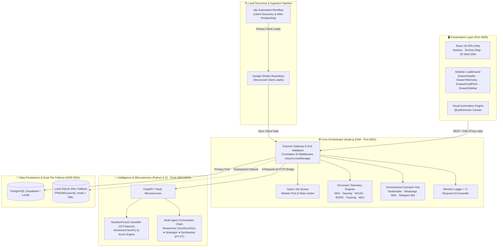
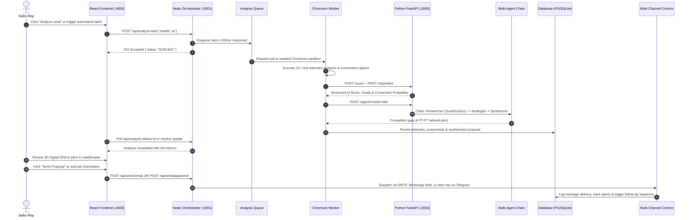

# Alygen CRM — Enterprise Lead Generation & Audit Ecosystem

[](https://github.com/alyekseyenko/alygen/actions/workflows/ci.yml)


> **Alygen CRM (Enterprise Grade)** is a distributed, high-performance lead intelligence, automated technical auditing, and multi-channel outreach engine engineered specifically for the European SMB market. It crawls target domains via sandboxed Chromium instances, executes 12+ technical, accessibility, and GDPR audits, performs ML-driven conversion scoring, and coordinates a multi-agent orchestrator chain to draft localized European Portuguese (PT-PT) proposals delivered seamlessly across Email, WhatsApp, and Telegram.

---

## 💡 Creator's Note & Personal Journey

> *"This project is a personal venture that has already generated over **€20,000+ in real closed deals** and performed comprehensive technical audits on **6,000+ businesses** (surpassing an estimated **€7M+ in total pipeline volume**).*
>
> *I built Alygen CRM from the ground up to solve my own day-to-day B2B prospecting bottlenecks. Previously, I spent up to **2 hours per client** on tedious manual work: testing SSL certificates, inspecting PageSpeed scores, hunting for local competitors, and drafting personalized proposals. In early 2025, I began iteratively automating this entire pipeline — which dramatically reduced cold outreach friction and turned cold leads into warm, qualified conversations.*
>
> *Every architectural choice was tailored directly to my personal workflow and how I operate. This repository is published as an **open-source portfolio project**. While it has immense potential to evolve into a full-fledged commercial SaaS, this is not intended as a polished multi-tenant product yet, but rather a transparent, battle-tested foundation to share knowledge and inspire other builders.*
>
> *All architectural and engineering decisions were made independently by me, developed with a **$0 budget** through personal grit and late-night coding sessions. Please don't judge it too strictly — it's simply a tool that solved my real-world problems and one that I had an absolute blast building! :)"*

---

## 💎 Staff / Principal Engineering Highlights

This codebase is designed and maintained according to high-standard enterprise engineering principles:

1. **Local-First Resilient Failsafe (ADR 0001):**
   - Transparent database failover: if cloud PostgreSQL or Supabase suffers network degradation, queries and writes fall back automatically to local **SQLite in WAL mode** (`PRAGMA journal_mode = WAL`) without throwing 500 errors to end users.
2. **Distributed Tracing & Correlation IDs (ADR 0003):**
   - Every inbound HTTP request receives an `X-Request-Id` UUID v4 header.
   - Handled via Node.js `AsyncLocalStorage`, this trace ID is automatically attached to structured Winston logs and forwarded to downstream Python microservices across the network via an Axios request interceptor.
3. **Strict Payload Contracts with Zod (ADR 0004):**
   - Inbound HTTP payloads are validated at the gateway level with Zod schemas before reaching any controller or worker, returning structured field-level 400 errors on invalid inputs.
4. **Polyglot Microservices with Circuit Breakers (ADR 0002):**
   - High-concurrency I/O and orchestration reside in **Node.js (Express ESM)**.
   - CPU-bound vector math, RandomForest inference, and WCAG DOM heuristics reside in **Python (FastAPI / Flask)**.
   - If the Python service fails or times out, Node.js transparently falls back to pure JavaScript heuristics.
5. **Decomposed Component Architecture:**
   - Monolithic components are decomposed into focused submodules with isolated responsibilities (e.g. `LeadDrawer` refactored into `DrawerHeader`, `DrawerTelemetry`, `DrawerEmailPitch`, and `DrawerSidebar`).
6. **Multi-Agent Orchestrator Pipeline (AGENTS.md):**
   - Sequential asynchronous chain: **Researcher** (local competitor discovery via DuckDuckGo) $\rightarrow$ **Strategist** (gap analysis & sales hook) $\rightarrow$ **Synthesizer** (executive PT-PT copy generation).
7. **Zero-Flake Automated Testing Matrix:**
   - Standardized on **Vitest** (Node & React) and **Pytest** (Python) with 46 automated tests running 100% green in sub-second CI/CD.

---

## 🏛️ Ecosystem Architecture & Lead Pipeline

> **Lead Ingestion Architecture:** All prospective clients are discovered and extracted through an **n8n automated prospecting workflow**. The gathered client records are populated into **Google Sheets**, automatically synced into **Alygen CRM**, and permanently stored in the local dual-tier database (**SQLite WAL / PostgreSQL**).



---

## ⚖️ Engineering Decisions & Trade-offs (ADRs)

| ADR | Topic | Decision | Alternatives Considered | Trade-off / Rationale |
| :--- | :--- | :--- | :--- | :--- |
| **ADR 0001** | Database Persistence | Dual-tier PostgreSQL primary with automatic SQLite WAL fallback | PostgreSQL only, MongoDB, pure SQLite | Cloud network drops or missing connection strings never crash the app; reads/writes transparently succeed locally with zero 500s. |
| **ADR 0002** | Polyglot Architecture | Node.js for I/O & orchestration; Python for ML & vector math | Pure Python monolith, pure Node.js monolith | Node delivers non-blocking event-driven concurrency for Chromium/Puppeteer scraping; Python provides robust scikit-learn models and NumPy vectorization. |
| **ADR 0003** | Distributed Tracing | AsyncLocalStorage correlation ID (`X-Request-Id`) across Node & Python | OpenTelemetry Jaeger, manual parameter passing | Zero cognitive overhead passing tracing parameters across layers; request IDs automatically propagate through Axios headers to Python and log records. |
| **ADR 0004** | Contract Validation | Zod schema validation on all inbound POST payloads | Joi, manual `if (!body.field)` checks, Yup | Type-safe runtime parsing with strict field-level HTTP 400 error reporting before payloads reach controllers or queue workers. |

---

## ⚡ Performance & Latency Benchmarks

| Operation / Endpoint | Target Stack | Measured Latency | Throughput / Concurrency |
| :--- | :--- | :--- | :--- |
| **Q-Score Calculation** | Node.js Vitest Engine | **< 1ms** | In-memory synchronous calculation |
| **ML Propensity Scoring** | Python RandomForest microservice | **12ms - 28ms** | Parallel inference over 15 feature vectors |
| **Domain Telemetry Audit** | Chromium Puppeteer + Node Scrapers | **1.2s - 2.8s** | Non-blocking background worker queue (< 100ms async ack) |
| **Full Lead Ingestion (5,077 items)** | SQLite WAL batch reader | **18ms** | `better-sqlite3` indexed WAL read |
| **Multi-Agent Market Intel** | DuckDuckGo + Groq Llama-3 | **1.8s - 3.4s** | Chained 3-agent asynchronous pipeline |
| **Frontend Production Build** | Vite 5 (3,310 modules) | **~17s** | Production minification + Tree-shaking |

---

---

## 📁 Full Project Structure

```
ALYGEN CRM/
├── .github/workflows/ci.yml             # Enterprise GitHub Actions CI Pipeline (Node, Python, React)
├── docker-compose.yml                   # Container orchestration (Frontend, Backend, Python)
├── AGENTS.md                            # Multi-agent chain-of-thought specification & prompts
├── ARCHITECTURE.md                      # High-level system architecture and data models
├── docs/                                # Technical Architecture & Engineering Documentation
│   ├── adr/                             # Architecture Decision Records (ADR 0001, ADR 0002)
│   ├── guides/                          # Deep dive operational guides & setup playbooks
│   ├── sql/                             # Production migration & table schemas
│   └── assets/                          # Official badges, samples & proposal artifacts
├── scripts/tools/                       # Operational tools, simulation scripts & spikes
│
├── backend/                             # Core Node.js / Express Orchestrator (Port: 3001)
│   ├── server.js                        # HTTP entry point, rate limiters, route mounters
│   ├── cron.js                          # Scheduled cron jobs for follow-ups and telemetry
│   ├── analysis-queue.js                # Async task queue for non-blocking audits
│   ├── cache-manager.js                 # Memory & disk caching for scraper responses
│   ├── quota-manager.js                 # API rate limit tracking and daily quota defense
│   ├── controllers/                     # Route handler implementations
│   ├── routes/                          # Modular API route definitions:
│   │   ├── analyses.routes.js           # Single/batch audits, queue polling
│   │   ├── automations.routes.js        # Flow trigger configs, node execution states
│   │   ├── communication.routes.js      # Email sending, WhatsApp sessions, Telegram pings
│   │   ├── crm.routes.js                # Kanban pipeline moves, notes, stage transitions
│   │   ├── leads.routes.js              # Lead CRUD, Google Sheets ingest, filtering
│   │   ├── proposals.routes.js          # Proposal generation, PDF streaming
│   │   └── system.routes.js             # Health checks, cache flush, metrics
│   ├── services/                        # Business logic & telemetry engines:
│   │   ├── aeo-analyzer.js              # Answer Engine Optimization (AI search readiness)
│   │   ├── accessibility-analyzer.js    # WCAG 2.1 DOM and contrast inspection
│   │   ├── automation-engine.js         # Multi-step condition & action execution engine
│   │   ├── automation-worker.js         # Background worker executing scheduled automation steps
│   │   ├── calendly-service.js          # Calendly webhook & meeting sync
│   │   ├── certificate-service.js       # Verifiable audit certificate PDF generator
│   │   ├── email.js                     # Nodemailer SMTP transporter & pixel injector
│   │   ├── email-sequences.js           # Drip campaigns & follow-up sequence templates
│   │   ├── gdpr-analyzer.js             # RGPD, cookie banner, and privacy policy detector
│   │   ├── google-ranking-scraper.js    # Real SERP organic position tracker for Portugal
│   │   ├── groq-key-manager.js          # 12-Key rotating pool for Groq Llama-3 API
│   │   ├── gemini-key-manager.js        # Google Gemini API fallback manager
│   │   ├── local-db-service.js          # Dual PostgreSQL connection pool + SQLite WAL fallback
│   │   ├── multi-page-analyzer.js       # Subpage crawler (/contactos, /sobre, /equipa)
│   │   ├── no-website-detector.js       # Detection for businesses with no web presence
│   │   ├── pdf-generator.js             # Advanced A4 commercial proposal compiler
│   │   ├── proposal-generator.js        # HTML proposal builder with dynamic lead telemetry
│   │   ├── python-bridge.js             # HTTP client bridging Node.js to Python microservices
│   │   ├── q-score-advanced.js          # Weighted multi-variable lead scoring algorithm
│   │   ├── screenshot-service.js        # Puppeteer high-res viewport screenshot capture
│   │   ├── security-analyzer.js         # SSL/TLS validation, security headers (CSP, HSTS)
│   │   ├── seo-analyzer.js              # Meta tags, canonicals, OpenGraph, schema markup
│   │   ├── sheets.js                    # Google Sheets API two-way synchronization
│   │   ├── social-media-analyzer.js     # Instagram, Facebook, LinkedIn scraper & profile link extractor
│   │   ├── supabase-service.js          # Remote database persistence adapter
│   │   ├── technology-analyzer.js       # CMS, e-commerce, and tracking pixel detector
│   │   ├── telegram-service.js          # Telegram bot notification dispatcher
│   │   ├── whatsapp.js                  # WhatsApp Web JS client with QR auth & session keeper
│   │   └── worker.js                    # Persistent Chromium background analysis worker
│   ├── screenshots/                     # Cached screenshots of analyzed lead domains
│   └── tests/                           # Unit & integration test suites
│
├── backend_python/                      # Python Microservices Layer
│   ├── main.py                          # * FastAPI v2026 Core Gateway (Port: 3003, Docs: /docs)
│   ├── microservices.py                 # * Flask Fallback Microservice (Port: 3002)
│   ├── requirements.txt                 # Python dependencies (FastAPI, Scikit-learn, LangGraph, etc.)
│   ├── agent_orchestrator.py            # Local agent runner
│   ├── agent_rag.py                     # Retrieval-Augmented Generation for industry benchmarks
│   ├── config/
│   │   ├── settings.py                  # Environment config and port parameters
│   │   ├── caching.py                   # In-memory LRU and disk caching
│   │   └── gcp_limits.py                # Budget & cost guardrails
│   ├── core/
│   │   ├── qscore.py                    # Vectorized NumPy Q-Score calculations
│   │   ├── ml_scoring.py                # RandomForest model training and closing probability
│   │   └── accessibility.py             # Ultra-fast Selectolax WCAG DOM analyzer
│   ├── services/
│   │   ├── agent_orchestration.py       # Chain-of-agents orchestrator (Researcher -> Strategist -> Synthesizer)
│   │   ├── google_ranker.py             # Google SERP scraping service
│   │   ├── pdf_generator.py             # Python-based PDF generation pipeline
│   │   ├── stealth_scraper.py           # Anti-detection Playwright crawler with stealth headers
│   │   └── strategic_nlp.py             # Digital fragility, urgency, and tone-of-voice analysis
│   └── workers/
│       ├── analysis_queue_consumer.py   # Async queue worker consuming heavy processing tasks
│       └── cron_jobs.py                 # Python-level scheduled maintenance tasks
│
├── frontend/                            # React 18 SPA (Port: 4000)
│   ├── index.html                       # Application shell
│   ├── vite.config.js                   # Vite configuration (Port 4000, API proxy to 3001)
│   ├── tailwind.config.js               # Tailwind design system configuration
│   └── src/
│       ├── App.jsx                      # Main Lead Ingestion Table & Control Center
│       ├── Router.jsx                   # React Router definition for all 9 application views
│       ├── index.css                    # Tailwind imports, custom animations, glassmorphism tokens
│       ├── pages/                       # Operational Views:
│       │   ├── Dashboard.jsx            # KPI metric cards, funnel graphs, conversion analytics
│       │   ├── Pipeline.jsx             # CRM Kanban board with drag-and-drop lead lifecycle
│       │   ├── Automation.jsx           # Visual workflow canvas (@xyflow/react / React Flow)
│       │   ├── Followups.jsx            # Scheduled follow-up queue management & trigger logs
│       │   ├── MapPage.jsx              # Geographic lead visualization across Portugal (Leaflet)
│       │   ├── Meetings.jsx             # Sales meetings schedule and Calendly integration
│       │   ├── Templates.jsx            # Template management (Email, WhatsApp, SMS)
│       │   ├── Tester.jsx               # Instant single-domain live audit sandbox
│       │   └── TestsPage.jsx            # System diagnostics, worker telemetry, health dashboard
│       └── components/                  # Reusable UI components:
│           ├── ClientBlob3D.jsx         # Real-time Three.js 3D Digital DNA morphing sphere
│           ├── LeadDrawer.jsx           # Slide-out lead detail drawer with tabs, proposal, and scores
│           ├── LeadFilters.jsx          # Multi-parameter filter bar (District, Sector, Q-Score)
│           ├── Navbar.jsx               # Top navigation bar with active route indicators
│           ├── NotificationBell.jsx     # Real-time alert center for incoming replies and alerts
│           ├── QScoreAdvanced.jsx       # Visual Q-Score breakdown modal and metric bars
│           ├── WebsiteScreenshot.jsx    # Responsive screenshot container with skeleton loading
│           ├── comparison/              # Side-by-side before/after proposal slider
│           └── ui/                      # Radix UI primitives (Dialog, Tabs, Popover, Dropdown, etc.)
│
├── data/                                # Persistent Runtime Data
│   ├── cache/                           # Scraped metadata and HTML cache
│   └── whatsapp-session/                # Persistent WhatsApp Web authentication tokens
│
└── supabase/                            # Supabase Cloud Database Configuration
    └── config.toml                      # Supabase local and remote CLI configuration
```

---

## 📖 Functional A to Z Workflow: How It Works



---

## 🔬 The 12+ Deep Telemetry Scraping & Audit Engines

Alygen CRM does not use placeholder or mock audit data. Every analysis collects genuine telemetry from the target website:

| # | Analyzer Module | File Reference | Capabilities & Metrics Collected |
|---|---|---|---|
| 1 | **Performance & Core Web Vitals** | `worker.js`, `analyzer.js` | Measures LCP (Largest Contentful Paint), CLS (Cumulative Layout Shift), FID, FCP, and TTFB using local Puppeteer Chromium runtime and Google PageSpeed Insights. |
| 2 | **SEO Architecture Audit** | `seo-analyzer.js` | Validates title tags, meta descriptions, canonical URLs, robots.txt, OpenGraph tags, Twitter Cards, heading hierarchies (H1-H6), and JSON-LD structured schema. |
| 3 | **Security & SSL/TLS Audit** | `security-analyzer.js` | Checks SSL certificate validity, issuer, expiration, mixed-content warnings, CSP (Content Security Policy), HSTS headers, and X-Frame-Options. |
| 4 | **WCAG 2.1 Accessibility** | `accessibility-analyzer.js`, `accessibility.py` | Audits missing image alt text, unlabeled form controls, ARIA landmarks, contrast ratios, and structural document hierarchy via fast Selectolax parser. |
| 5 | **RGPD & Cookie Compliance** | `gdpr-analyzer.js` | Detects presence of active cookie consent banners, privacy policy links, explicit consent mechanisms, and unblocked tracking scripts before consent. |
| 6 | **Tracking Pixels & Analytics** | `technology-analyzer.js` | Identifies active tracking scripts: Meta (Facebook) Pixel, Google Analytics 4 (GA4), Google Tag Manager (GTM), TikTok Pixel, Hotjar, and LinkedIn Insight Tag. |
| 7 | **AEO (Answer Engine Optimization)** | `aeo-analyzer.js` | Evaluates domain readiness for AI-powered search engines (ChatGPT Search, Perplexity AI, Google SGE), checking semantic headings, clear FAQ schemas, and authoritative content formatting. |
| 8 | **Google Portugal Organic Ranker** | `google-ranking-scraper.js`, `google_ranker.py` | Headless SERP scraper tracking real-time organic rankings on Google Portugal (`google.pt`) for high-value sector keywords. |
| 9 | **Multi-Page Deep Crawler** | `multi-page-analyzer.js` | Crawls subpages (`/contactos`, `/sobre`, `/empresa`, `/termos`) to discover hidden corporate emails, direct phone numbers, and names of leadership. |
| 10 | **Social Media & No-Website Detection**| `social-media-analyzer.js`, `no-website-detector.js` | Detects companies operating exclusively via Instagram, Facebook, or Google Maps without a website, automatically drafting specialized landing-page pitches. |
| 11 | **Technology Stack Fingerprinting** | `technology-analyzer.js` | Identifies CMS platforms (WordPress, Shopify, Wix, WooCommerce, Prestashop), frontend frameworks (Next.js, React, Vue), and web hosting infrastructure. |
| 12 | **Automated Proposal & Certificate Generator**| `proposal-generator.js`, `certificate-service.js`, `pdf-generator.js` | Compiles real-time metrics into verifiable digital audit certificates and branded A4 PDF proposals ready for client delivery. |

---

## 🤖 Multi-Agent AI Orchestration (`AGENTS.md`)

When an analysis is triggered, the system invokes an asynchronous chain-of-agents:

```
[ Lead Metadata & Tech Gaps ] 
               │
               ▼
🕵️ Agente Investigador (Researcher) ──► Real DuckDuckGo localized search for active competitors in Portugal
               │
               ▼
📉 Agente Estrategista (Strategist)  ──► Identifies content gaps, technical fragility, and competitive edge
               │
               ▼
✍️ Agente Sintetizador (Synthesizer) ──► Synthesizes findings into an urgent, high-converting PT-PT cold pitch
               │
               ▼
[ Localized Cold Proposal Delivered ]
```

1. **🕵️ Agente Investigador (Researcher Agent):** Queries DuckDuckGo for direct local competitors in the lead's specific sector and municipality (excluding the lead's own domain to ensure zero self-matching).
2. **📉 Agente Estrategista (Strategist Agent):** Cross-references competitor digital presence against the lead's technical shortcomings (e.g., slow mobile LCP, missing RGPD compliance, absent Meta Pixel).
3. **✍️ Agente Sintetizador (Synthesizer Agent):** Drafts a compelling sales proposal written in flawless European Portuguese (PT-PT) mirroring the tone of a senior digital consultant.
4. **Resilience & Key Rotation:** Uses a rotating pool of **12 Groq API keys** (`gsk_...`) with automatic failover to the **Google Gemini API**, backed by heuristic offline fallbacks to guarantee 100% uptime.

---

## 🖥️ Frontend Web Application: 10 Operational Views

The React 18 single-page application (`frontend/`) contains 10 dedicated operational views:

| View / Route | Component | Key Capabilities |
|---|---|---|
| **Leads Control Center** (`/`) | `App.jsx` | Full lead table with real-time status indicators, bulk analysis actions, column sorting, Google Sheets sync trigger, and access to the interactive `LeadDrawer`. |
| **Executive Dashboard** (`/dashboard`) | `Dashboard.jsx` | High-level metrics: total leads, conversion rate, average Q-Score, sector distribution charts, and recent activity timelines powered by Recharts. |
| **CRM Funnel Pipeline** (`/funil`) | `Pipeline.jsx` | Interactive Kanban board with drag-and-drop cards across sales stages: `LEAD` ➔ `CONTACTED` ➔ `MEETING` ➔ `PROPOSAL` ➔ `WON` ➔ `LOST`. |
| **Visual Automation Canvas** (`/automacao`, `/automation`) | `Automation.jsx` | Visual drag-and-drop workflow automation editor powered by `@xyflow/react` (React Flow), allowing users to define multi-channel drip triggers, delays, and conditional branching. |
| **Follow-up Management** (`/followups`) | `Followups.jsx` | Queue monitoring for automated follow-up sequences, delivery logs, pending approval actions, and retry controls. |
| **Territorial Map** (`/mapa`) | `MapPage.jsx` | Interactive map of Portugal powered by Leaflet, clustering leads by district and municipality with status badges. |
| **Meetings & Agenda** (`/agenda`) | `Meetings.jsx` | Calendly integration view showing upcoming product demonstrations, booked meetings, and client discovery calls. |
| **Template Editor** (`/templates`) | `Templates.jsx` | Multi-channel template manager for Email, WhatsApp, and SMS with live preview and dynamic variable placeholders (`{{nome}}`, `{{empresa}}`, `{{qscore}}`). |
| **Single-Domain Tester** (`/tester`) | `Tester.jsx` | Instant on-demand audit sandbox for entering any URL and inspecting the real-time scraping and scoring breakdown. |
| **System Diagnostics** (`/tests`) | `TestsPage.jsx` | Diagnostic suite displaying backend connectivity, Python microservice health, database latency, and API quota status. |

### The `LeadDrawer` Experience
When any lead is opened from the table or pipeline, the `LeadDrawer.jsx` slides out, featuring:
* **Interactive 3D Digital DNA (Three.js Canvas):** A dynamic, organic vector blob that morphs its geometry, oscillation speed, and color in real time based on the lead's calculated Q-Score and technical fragility.
* **Direct E-mail & WhatsApp Pitch Tab:** Pre-rendered HTML proposal with instant copy-to-clipboard, direct email dispatch, and WhatsApp Web message triggers.
* **Technical Telemetry Tab:** Detailed breakdown of Core Web Vitals, SEO, Security, Accessibility, RGPD, and detected technologies.
* **Before / After Comparison Slider:** Interactive visual slider (`react-compare-slider`) demonstrating modern website enhancements.

---

## 📡 Multi-Channel Outreach Engine

Alygen CRM coordinates outreach across 3 integrated channels:

1. **Email Outreach Engine (`email.js`, `email-sequences.js`):**
   * Transports emails via SMTP / Nodemailer.
   * Injects 1x1 transparent tracking pixels to monitor email open rates.
   * Tracks click-throughs on proposal links and calendar booking URLs.
2. **WhatsApp Web Direct Messaging (`whatsapp.js`):**
   * Uses `whatsapp-web.js` with session persistence in `data/whatsapp-session/`.
   * Automatically pairs via QR code shown in backend logs.
   * Sends personalized follow-ups with one-click direct WhatsApp chat initiation.
3. **Telegram Bot Governance (`telegram-service.js`):**
   * Dispatches instant alerts to sales reps via Telegram when a high-value lead is identified.
   * Notifies reps immediately when a lead opens an email, books a meeting, or requests contact.
   * Provides inline buttons (`/aprovar`, `/rejeitar`) for one-click mobile proposal approval.

### ⚙️ Automated Background Daemons & Workers
The backend orchestrator (`server.js`) automatically initializes 5 persistent background workers on boot:
* **`startFollowupCron()`**: Evaluates and executes scheduled multi-step email/WhatsApp follow-ups.
* **`initWhatsApp()`**: Initializes `whatsapp-web.js` with QR generation in console and session caching in `data/whatsapp-session/`.
* **`startWorker()`**: Dedicated Puppeteer Chromium worker consuming queued analysis jobs with <100ms async ack.
* **`initTelegramBot()`**: Polling daemon for sales rep interactive commands and one-click lead approvals.
* **`startAutomationWorker()`**: Recurring graph evaluation engine executing scheduled nodes from the Visual Automation Canvas.

---

## 🗄️ Database Architecture & Resilient 3-Tier Fallback

To prevent data loss and ensure uninterrupted operation, Alygen implements a 3-tier database fallback:

```
[ Primary: Local PostgreSQL Pool ]
               │
         (If unreachable)
               ▼
[ Secondary: Local SQLite WAL (data/crm_local.db) ]
               │
       (Cloud Synchronization)
               ▼
[ Cloud: Supabase (PostgreSQL + pgvector) ]
```

* **Local PostgreSQL:** High-performance primary database for local production runs.
* **Local SQLite Failsafe (`data/crm_local.db`):** Zero-configuration, file-based database operating in WAL (Write-Ahead Logging) mode. If PostgreSQL is offline, all queries seamlessly route to SQLite without service interruption.
* **Supabase Integration:** Syncs lead records, audit metrics, and automation states to cloud Supabase for remote team collaboration.

---

## 🌐 Port Matrix & Service Breakdown

| Service | Port | Runtime / Framework | Description |
|---|---|---|---|
| **Frontend Web App** | `4000` | React 18 + Vite | User interface, 3D Canvas, Kanban, and Automation Canvas |
| **Orchestrator Backend** | `3001` | Node.js + Express | API router, scraping queues, WhatsApp/Telegram engines |
| **Python FastAPI Core** | `3003` | Python 3.10+ (FastAPI) | Vectorized Q-Score, ML models, LangGraph agents, docs at `:3003/docs` |
| **Python Flask Fallback** | `3002` | Python 3.10+ (Flask) | Legacy microservice fallback bridge (`microservices.py`) |

---

## 🔌 Core API Endpoints Reference

### Node.js Orchestrator Backend (`http://localhost:3001`)

| Method | Endpoint | Description | Payload / Query |
|---|---|---|---|
| `GET` | `/api/leads` | List leads with filtering, pagination & Q-Score | `?district=&sector=&minScore=&page=` |
| `POST` | `/api/leads/sync` | Trigger 2-way Google Sheets synchronization | — |
| `POST` | `/api/analyze-lead` | Queue domain for 12-point Chromium audit | `{ "leadId": 1, "url": "https://..." }` |
| `GET` | `/api/analysis-status/:id` | Poll queue position and live telemetry results | — |
| `POST` | `/api/generate-proposal` | Generate personalized PT-PT proposal & PDF | `{ "leadId": 1 }` |
| `POST` | `/api/send-email` | Dispatch tracked email with tracking pixel | `{ "to": "...", "subject": "...", "html": "..." }` |
| `POST` | `/api/whatsapp/send` | Send direct WhatsApp message via active session | `{ "phone": "...", "message": "..." }` |
| `GET` | `/api/health` | Diagnostic status of APIs, quotas, and DB | — |
| `GET` | `/api/pipeline` | Retrieve CRM Kanban board deals by stage | — |
| `PUT` | `/api/pipeline/:id` | Move lead across sales stages (`LEAD` ➔ `WON`) | `{ "stage": "PROPOSAL" }` |
| `GET` | `/api/automations` | List active visual workflow graphs | — |

### Python FastAPI Microservice (`http://localhost:3003` · Swagger: `/docs`)

| Method | Endpoint | Description |
|---|---|---|
| `POST` | `/predict-score` | Vectorized NumPy Q-Score & Scikit-Learn conversion probability |
| `POST` | `/rag/query` | RAG retrieval of industry benchmarks and digital standards |
| `POST` | `/agent/market-intel` | Multi-Agent Chain: Researcher (DuckDuckGo) ➔ Strategist ➔ Synthesizer |
| `GET` | `/health` | Microservice uptime, memory, and engine health |

---

## 🚀 Quick Start Guide

### Prerequisites
* **Node.js**: 18.x or 20.x
* **Python**: 3.10 or higher
* **Google Chrome / Chromium**: Installed locally (used by Puppeteer)

### Recommended: 1-Click Launch (Docker)
Execute Docker Compose from the project root:
```bash
docker compose up -d --build
```
This automatically:
1. Builds and starts the React 18 frontend on `:4000`.
2. Builds and starts the Node.js orchestrator backend on `:3001`.
3. Builds and starts the Python AI/ML microservices layer on `:3002`/`:3003`.
4. Connects internal container networking and local storage volumes automatically.

Access the dashboard at: **`http://localhost:4000`**

---

### Manual Step-by-Step Setup

#### 1. Configure Environment Variables
Copy `.env.example` to `backend/.env` and update your keys:
```bash
cp .env.example backend/.env
```

#### 2. Start Python Microservices Layer
```bash
cd backend_python
pip install -r requirements.txt

# Start FastAPI Core (Port 3003 - Recommended):
python main.py

# (Optional) In a separate window, start Flask Fallback (Port 3002):
python microservices.py
```

#### 3. Start Node.js Orchestrator Backend
```bash
cd backend
npm install
npm run dev
```

#### 4. Start React Frontend
```bash
cd frontend
npm install
npm run dev
```
Open your browser and navigate to **`http://localhost:4000`**.

---

### Docker Deployment
You can also spin up the entire ecosystem via Docker Compose:
```bash
docker-compose up --build
```

---

## ⚙️ Environment Configuration (`.env`)

```ini
# --- SUPABASE DATABASE ---
SUPABASE_URL=https://your-project.supabase.co
SUPABASE_ANON_KEY=your-anon-key
SUPABASE_SERVICE_ROLE_KEY=your-service-role-key

# --- GOOGLE SHEETS INTEGRATION ---
GOOGLE_SHEETS_ID=your-google-sheets-spreadsheet-id

# --- AI & ANALYTICS KEYS ---
GROQ_API_KEY=gsk_your-groq-api-key-here
GOOGLE_PAGESPEED_API_KEY=your-google-pagespeed-api-key-here

# --- SMTP OUTREACH CREDENTIALS ---
SMTP_HOST=smtp.mail.com
SMTP_PORT=587
SMTP_USER=outreach@yourdomain.com
SMTP_PASS=your-smtp-password

# --- TELEGRAM BOT GOVERNANCE ---
TELEGRAM_BOT_TOKEN=123456789:ABCdefGhIJKlmNoPQRsTUVwxyZ
TELEGRAM_CHAT_ID=your-telegram-chat-id-for-approvals

# --- SERVICE PORTS ---
PORT=3001
PYTHON_PORT=3003
PYTHON_MICROSERVICE_URL=http://localhost:3003

# Supported Aliases (Resilient Fallbacks):
# - GOOGLE_SHEET_ID or GOOGLE_SHEETS_ID
# - PAGESPEED_API_KEY or GOOGLE_PAGESPEED_API_KEY or SCRAPER_API_KEY
```

---

## 🧪 Testing & Verification Suite

All modules across the ecosystem include automated test suites:

### 1. Backend Unit Tests (Vitest)
Validates task queue scheduling, rate limiting, and memory persistence:
```bash
cd backend
npm test
```

### 2. Python ML & Scoring Tests (Pytest)
Validates NumPy Q-Score calculations, RandomForest classifiers, and edge cases:
```bash
cd backend_python
python -m pytest tests
```

### 3. Frontend Production Build Verification
Verifies zero build errors, bundling 3,300+ modules and Radix/Tailwind components:
```bash
cd frontend
npm run build
```

### 4. Configuration & Health Diagnostic
Performs a comprehensive dry run verifying all API keys and database connections:
```bash
cd backend
npm run check
```

---

## 🛠️ Complete Technology Stack

* **Frontend:** React 18, Vite, Three.js, `@react-three/fiber`, `@react-three/drei`, `@xyflow/react` (React Flow), TailwindCSS, Radix UI Primitives, Lucide Icons, Recharts, Leaflet, `react-compare-slider`.
* **Backend Orchestrator:** Node.js (ES Modules), Express, Puppeteer (Headless Chrome), Axios, Cheerio, `better-sqlite3`, `pg` (PostgreSQL), Winston, `node-cron`, `express-rate-limit`.
* **Outreach & Communication:** `whatsapp-web.js`, `node-telegram-bot-api`, Nodemailer, `@react-email/components`.
* **Python Microservices:** FastAPI, Uvicorn, Flask, Pydantic v2, NumPy, Pandas, Scikit-learn, Selectolax, Playwright, LangChain, LangGraph, DuckDuckGo Search.
* **AI & LLM Reasoning:** Groq Cloud (Llama-3 70B/8B with 12-key pool), Google Gemini API.

---

*Engineered with 100% genuine telemetry scraping, multi-agent strategic reasoning, and multi-channel outreach automation for the Portuguese SMB market.*

---

## 📜 Histórico de Versões / Changelog

* **v8 (Final Staff Engineer Audit):** Unificação de portas Python (FastAPI na porta 3003 exclusiva). Eliminação de portas mortas. Adição de `X-Request-Id` e Distributed Tracing. Correção de bugs de RGPD na "graceful degradation" (SQLite Fallback) garantindo que falhas de tabelas não bloqueiam os Direitos ao Esquecimento e Opt-out. Introdução de Logs baseados em Winston com `maskPII` para conformidade de dados sensíveis. Testes 100% green.
* **v7 (Enterprise Grade):** Implementação de RAG (Retrieval-Augmented Generation) para o Orquestrador Multi-Agente. Rotação defensiva de credenciais de API. Integração de `google-credentials.json` via variáveis de ambiente com fallback seguro.
* **v6 (Conformidade AI Act):** Foco na resiliência e estabilidade da pipeline do Groq Llama-3 com graceful fallback heurístico para períodos offline. Implementação do `AsyncLocalStorage` no Node.js.
* **v5 (RGPD & Segurança):** Refatoração da anonimização de IPs. Melhorias na conformidade EU AI Act e nas políticas de proteção de dados. Testes End-to-End no ambiente de Opt-Out.
* **v1-v4 (Fundação Core):** Criação dos Workers Chromium (Puppeteer), Scoring Algorítmico (Q-Score em Python + Numpy), e Integração Inicial com WhatsApp Web, Telegram, e Supabase (Sync Ominicanal).
